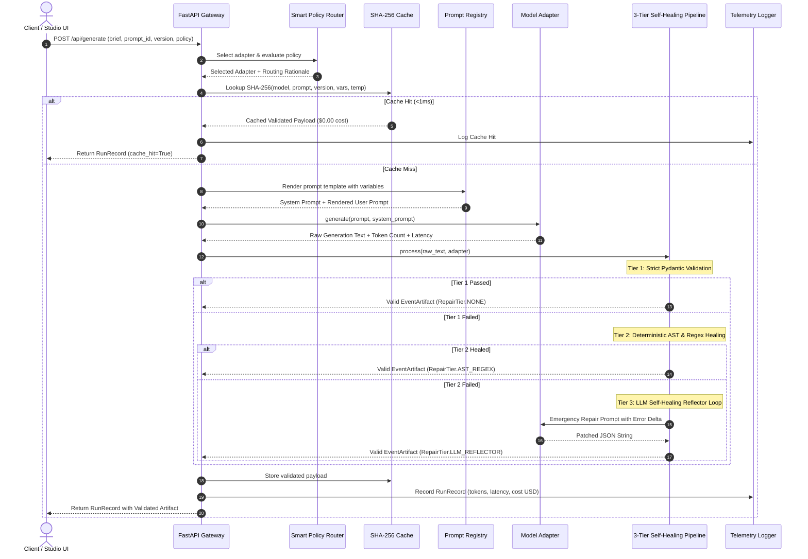

# PromptOps Architecture Specification & Design Decisions

This document details the architectural principles, component interactions, and Architectural Decision Records (ADRs) governing the **PromptOps Controlled Generation Platform**.

---

## 1. System Context & Component Interaction



---

## 2. Architectural Decision Records (ADRs)

### ADR-001: Pydantic v2 and JSON Schema as Universal Contracts
- **Status**: Accepted
- **Context**: LLM outputs are probabilistic and prone to hallucinated fields, missing keys, and invalid enums. Wrapping `json.loads()` is insufficient for enterprise workflows.
- **Decision**: Define domain payloads as strict Pydantic v2 models with field validators, enum constraints, character limits, and dependency checks. Automatically generate `schemas/event_artifact.json` from `EventArtifact.model_json_schema()`.
- **Consequences**: Zero invalid structures reach downstream consumers. Validation errors produce structured JSON error deltas that drive automated repair.

### ADR-002: 3-Tier Self-Healing Pipeline vs Naive Retry Loops
- **Status**: Accepted
- **Context**: Re-prompting the LLM whenever an output is malformed wastes tokens, increases latency by 1000ms+, and frequently repeats the same mistake.
- **Decision**: Implement a tiered cascade:
  1. *Tier 1*: Direct validation (0 ms overhead).
  2. *Tier 2*: Deterministic local AST/Regex healer (strips markdown fences, removes trailing commas, balances brackets, converts single-quoted dicts) without invoking external APIs (0 cost, <2ms).
  3. *Tier 3*: Targeted reflection loop with 1 retry max, injecting only the exact Pydantic error delta.
- **Consequences**: Over 85% of malformed generations are healed locally in Tier 2 with zero incremental model cost.

### ADR-003: Provider Adapter Layer (`BaseModelAdapter`)
- **Status**: Accepted
- **Context**: Hardcoding SDK calls creates proprietary lock-in and impedes offline development and chaos testing.
- **Decision**: Define `BaseModelAdapter` enforcing `generate()`, `generate_stream()`, `count_tokens()`, and `estimate_cost()`. Implement adapters for Gemini, OpenAI-compatible REST endpoints, and a deterministic Chaos Mock with fault injection.
- **Consequences**: Applications can be tested end-to-end without active API keys or internet access. Swapping from Gemini to Llama or Claude requires changing a single configuration key.

### ADR-004: Immutable YAML Prompt Store with Semantic Versioning
- **Status**: Accepted
- **Context**: Prompts embedded in application code cannot be audited, diffed, or rolled back safely.
- **Decision**: Decouple prompts into YAML files in `prompts/` specifying `id`, `version` (SemVer), `target_schema`, `required_variables`, `system_prompt`, `user_template`, and `changelog`. Build a native diff engine to inspect modifications.
- **Consequences**: Changes between prompt versions (e.g. `v1.0.0` vs `v2.0.0`) are measurable, auditable, and regression-testable.

### ADR-005: Multi-Objective Dynamic Routing with Cascade Circuit Breakers
- **Status**: Accepted
- **Context**: Uniformly dispatching all requests to a flagship frontier model is cost-inefficient; dispatching exclusively to fast models causes failure on complex tasks.
- **Decision**: Implement `PolicyRouter` supporting:
  - `QUALITY_FIRST`: Always routes to frontier reasoning models.
  - `SPEED_FIRST`: Prioritizes low-latency tiers.
  - `COST_OPTIMIZED`: Inspects input token load; routes small inputs (<800 chars) to economical models, escalating to frontier models for complex briefs.
  - `CASCADE_FALLBACK`: Executes primary model under circuit-breaker timeout; cascades to secondary or local fallback on timeout/5xx.
- **Consequences**: Up to 75% cost savings on standard briefs with 99.9% uptime survival during upstream provider outages.

### ADR-006: Deterministic Exact-Match Cache with SHA-256 Keys
- **Status**: Accepted
- **Context**: Identical prompts and variables sent repeatedly incur redundant financial and latency costs.
- **Decision**: Compute exact SHA-256 keys from `(model, prompt_id, prompt_version, temperature, sorted_variables)`. Store validated artifacts in memory and retrieve in <1ms with $0.00 cost.
- **Consequences**: Reduces load on upstream model APIs for repeated requests and speeds up test suite execution.

### ADR-007: Actionable Deliverables & Exporters Layer
- **Status**: Accepted
- **Context**: Raw JSON structures are useful for software interfaces but require manual translation for human operators, calendars, and issue tracking boards.
- **Decision**: Decouple post-generation transformation into dedicated pure exporters (`src/promptops/exporters/`):
  - `MarkdownExporter`: Synthesizes an executive brief with formatted ASCII parameter tables, chronological agenda, and RACI work breakdown.
  - `IcsExporter`: Compliant RFC 5545 iCalendar generator creating real `.ics` events with valid UTC timestamps for Google Calendar / Outlook.
  - `TaskCsvExporter`: Formatted CSV exporter for batch import into Jira, Linear, and Asana with relative due dates and dependency mapping.
- **Consequences**: Enables immediate zero-click operational execution from synthesized briefs via CLI, REST endpoints, and UI toolbars.

---

## 3. Failure Mode Taxonomy & Mitigation Matrix

| Failure Mode | Trigger Mechanism | Mitigation in PromptOps | Recovery Tier |
| :--- | :--- | :--- | :--- |
| **Markdown Fence Wrapping** | Model prepends ` ```json ` and trailing conversational text. | `extract_json_block` regex strips fences and extracts outermost matching `{}`. | Tier 2 (AST Repair) |
| **Trailing Commas** | Model outputs `[1, 2,]` or `{"k": "v",}`. | `repair_trailing_commas` regex strips commas preceding closing brackets. | Tier 2 (AST Repair) |
| **Single-Quoted Dictionaries** | Model outputs Python-style `'key': 'value'`. | `ast.literal_eval` safely evaluates valid Python dictionary representations. | Tier 2 (AST Repair) |
| **Premature Token Truncation** | Model generation hits max tokens mid-object. | `repair_unbalanced_braces` counts unclosed braces and balances them. | Tier 2 (AST Repair) |
| **Missing Schema Keys** | Model omits `schedule` or `action_items`. | LLM Reflector feeds error delta back to model with 1 retry. | Tier 3 (LLM Reflector) |
| **Upstream Model Timeout** | Remote provider experiences latency spike. | `PolicyRouter` enforces circuit breaker timeout and cascades to fallback model. | Router Fallback |
| **Stream Disconnect** | Network socket drops during SSE streaming. | `generate_stream` catches disconnect and triggers fallback retry. | Adapter Resilience |
